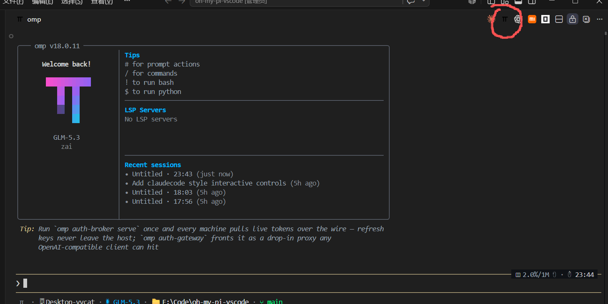
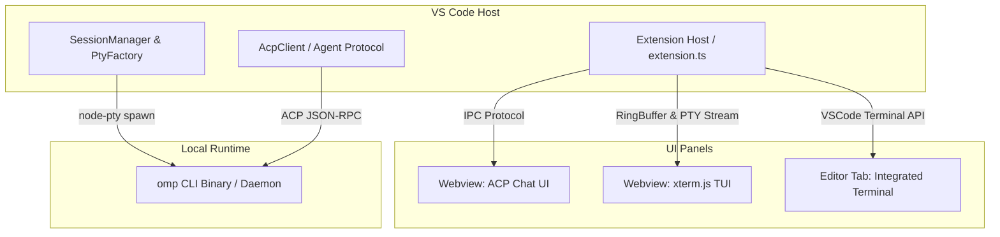

<div align="center">

# 🥧 Oh My Pi for VS Code (`oh-my-pi-vscode`)

**Powering seamless Oh My Pi (omp) AI Agent interactions directly inside your VS Code workspace.**

[](https://code.visualstudio.com/)
[](package.json)
[](LICENSE)
[]()
[](tsconfig.json)

[快速开始](#-快速部署与安装) • [功能特性](#-核心特性) • [使用指南](#-使用指南) • [配置选项](#-配置说明) • [常见问题](#-常见问题--troubleshooting)

<br/>



</div>

---

## 🌟 核心特性 (Features)

* 🤖 **双模交互架构**：
  * **💬 ACP 智能对话视图 (Chat View)**：原生 Webview 界面，支持流式 Markdown、思维链实时折叠卡片 (Thinking Process)、工具调用可视化、角色/模型无缝切换。
  * **⚡ TUI 终端视图 (Terminal View)**：基于 `node-pty` + `@xterm/xterm` 深度集成 `omp` 原生 TUI 会话，完整保留富文本彩色终端与会话持久化能力。
* 🎛️ **多模型 & 思考预算切换**：
  * 支持自由切换 Claude 3.7 / 3.5 Sonnet、Opus、GPT-4o、Gemini、DeepSeek 等大模型。
  * 支持自定义思维预算深度 (`low` / `medium` / `high` / `max`) 与模式预设（如 Plan 模式）。
* 🚀 **独立隔离会话**：每个侧边栏或编辑器标签页启动的 `omp` 均为独立进程与上下文，互不干扰，支持并发 Agent 任务。
* ⌨️ **沉浸式快捷键**：内置按键转发（如 `Ctrl+P` 等）与全局唤起快捷键，无缝穿透 VS Code 终端。

---

## 🏗️ 架构概览 (Architecture)



---

## 📦 快速部署与安装 (Quick Start)

### 0. 前置条件 (Prerequisites)
在使用本插件前，请确保系统已安装并配置好 `omp` CLI 命令行工具：
```bash
# 验证 omp 是否已安装并且处于环境变量 PATH 中
omp --version
```
> 若 `omp` 安装在自定义路径，可在 VS Code 设置中配置 `omp.executablePath`。

---

### 方式一：使用 `.vsix` 离线包安装（推荐用户使用）

#### 1. 打包生成 `.vsix` 文件
在项目根目录下运行编译与打包命令：
```bash
npm install
npm run compile
npx @vscode/vsce package
```
执行后会在根目录生成安装包，例如 `oh-my-pi-vscode-0.2.7.vsix`。

#### 2. 安装到 VS Code
* **图形界面安装**：
  1. 打开 VS Code，按 `Ctrl+Shift+X` (macOS: `Cmd+Shift+X`) 打开 **扩展** 面板。
  2. 点击右上角的 **`...`** (更多操作) 菜单。
  3. 选择 **「从 VSIX 安装... (Install from VSIX...)」** 并选中生成的 `.vsix` 文件。
* **命令行快速安装**：
  ```bash
  code --install-extension oh-my-pi-vscode-0.2.7.vsix
  ```

---

### 方式二：开发者调试与源码安装 (Developer Mode)

如果您希望参与开发、二次定制或在本地直接调试：

```bash
# 1. 克隆代码仓库
git clone https://github.com/chugwei/oh-my-pi-vscode.git
cd oh-my-pi-vscode

# 2. 安装依赖
npm install

# 3. 编译 TypeScript & Webview 资源
npm run compile

# 4. 启动监听模式（可选）
npm run watch
```

* **启动调试**：在 VS Code 中直接按 <kbd>F5</kbd>，即可打开带插件的 `[Extension Development Host]` 扩展开发测试窗口。

---

## 🎯 使用指南 (Usage)

| 入口 / 功能 | 快捷键 / 操作路径 | 说明 |
| :--- | :--- | :--- |
| **聚焦侧边栏** | <kbd>Ctrl+Alt+O</kbd> / <kbd>Cmd+Alt+O</kbd> | 快速唤出并聚焦 Oh My Pi 侧边栏 |
| **编辑器标签页运行** | <kbd>Ctrl+Alt+Shift+O</kbd> | 在编辑器主区域新建独立的 omp 终端标签页 |
| **新建终端会话** | 点击终端视图右上角 <kbd>+</kbd> 图标 | 在侧边栏新建一个并行的 omp 终端会话 |
| **快捷指令输入** | 在对话框中输入 `/` 或 `#` | 快速唤出 Slash Commands 指令库与上下文操作 |

---

## ⚙️ 配置说明 (Settings Reference)

在 VS Code `settings.json` 中可对插件行为进行自定义：

```json
{
  // omp 可执行文件路径（默认为 'omp'，Windows 会自动扫描 LOCALAPPDATA）
  "omp.executablePath": "omp",

  // 每次启动新会话时附带的默认参数
  "omp.defaultArgs": [],

  // 终端字体族（留空则默认继承 VS Code 集成终端字体）
  "omp.fontFamily": "",

  // xterm.js 历史回滚行数
  "omp.scrollback": 5000,

  // 穿透转发给 TUI 的按键组合
  "omp.passThroughKeys": [
    "ctrl+p"
  ],

  // ACP 模式预设与思维预算配置
  "omp.chat.modePresets": {
    "default": {
      "model": "google-antigravity/claude-sonnet-4-5",
      "thinking": "high"
    },
    "plan": {
      "model": "google-antigravity/claude-opus-4-6",
      "thinking": "max"
    }
  },

  // 默认启动模式
  "omp.chat.defaultMode": "default"
}
```

---

## ❓ 常见问题 & Troubleshooting

<details>
<summary><b>Q1: 提示找不到 <code>omp</code> 可执行文件或无法启动？</b></summary>
<br/>
请检查系统终端能否直接执行 <code>omp</code>。如果使用的是非全局环境变量路径，请在 VS Code 的用户设置中配置 <code>omp.executablePath</code> 指向完整绝对路径（例如 Windows 上的 <code>C:\Users\<User>\AppData\Local\omp\omp.exe</code>）。
</details>

<details>
<summary><b>Q2: 侧边栏终端加载报错 <code>node-pty could not be loaded</code>？</b></summary>
<br/>
<code>node-pty</code> 属于原生 C++ 二进制模块。如果是跨平台迁移项目，请在目标系统执行 <code>npm rebuild</code> 或重新执行 <code>npx @vscode/vsce package</code> 针对当前系统重新构建。同时，您仍然可以使用右上角的 <b>「Open in Editor Tab」</b> 通过 VS Code 原生终端无缝运行 omp。
</details>

<details>
<summary><b>Q3: 如何切换对话的大模型和 Thinking 预算？</b></summary>
<br/>
在侧边栏 <b>Chat 视图</b> 底部的状态栏中，可直接点击模型名称切换模型，或点击 Thinking 标签调整思考强度（Low / Medium / High / Max）。
</details>

---

## 📄 开源协议 (License)

本项目基于 [MIT License](LICENSE) 开源发布。
欢迎提交 Issue 和 Pull Request 共同完善！
